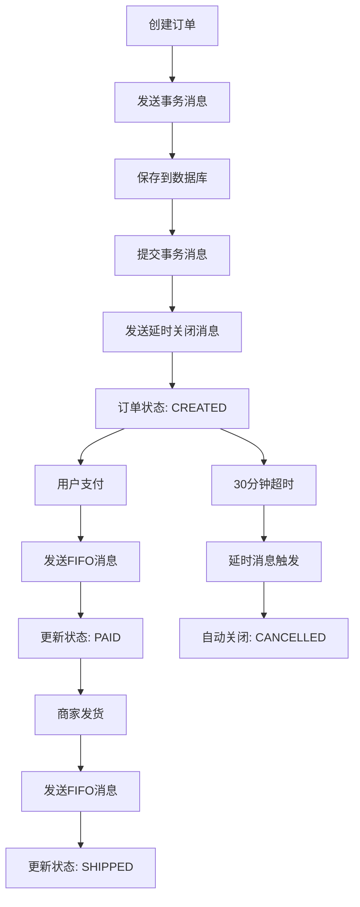

# RocketMQ Order Demo (Java + Spring Boot + MySQL)

一个基于 **RocketMQ 5.x** 的订单处理演示项目，展示了分布式消息队列在实际业务场景中的应用。本项目涵盖了 RocketMQ 的核心特性，包括事务消息、FIFO 消息、延时消息、重试机制、死信队列、幂等性处理和消息追踪等功能。

## 🎯 项目特色

- **完整的订单流程**: 创建 → 支付 → 发货 → 自动关闭
- **分布式事务**: 使用 RocketMQ 事务消息确保数据一致性
- **消息顺序**: FIFO 消息保证同一订单的状态变更按顺序处理
- **延时处理**: 30分钟后自动关闭未支付订单
- **可靠性保证**: 重试机制和死信队列处理异常情况
- **幂等性**: 防止消息重复处理
- **消息追踪**: 完整的消息生命周期追踪

## 🏗️ 技术架构

### 核心技术栈
- **Java 17** + **Spring Boot 3.2.5**
- **RocketMQ 5.3.2** (NameServer + Broker + Proxy)
- **MySQL 8.0** 数据持久化
- **Spring Data JPA** ORM框架
- **Docker Compose** 容器化部署

### 系统架构图
```
┌─────────────────┐    ┌──────────────────┐    ┌─────────────────┐
│   Web Client    │───▶│  Spring Boot App │───▶│   MySQL DB      │
└─────────────────┘    └──────────────────┘    └─────────────────┘
                                │
                                ▼
                       ┌──────────────────┐
                       │   RocketMQ       │
                       │  ┌─────────────┐ │
                       │  │ NameServer  │ │
                       │  └─────────────┘ │
                       │  ┌─────────────┐ │
                       │  │   Broker    │ │
                       │  └─────────────┘ │
                       │  ┌─────────────┐ │
                       │  │   Proxy     │ │
                       │  └─────────────┘ │
                       └──────────────────┘
```

### 消息流设计
```
订单创建 ──┐
          │ (事务消息)
          ▼
    OrderTxnTopic ──────────────┐
                                │
支付/发货 ──┐                    │
          │ (FIFO消息)           │
          ▼                     ▼
    OrderFifoTopic ────────▶ 订单状态更新
                                │
延时关闭 ──┐                     │
          │ (延时消息)            │
          ▼                     │
    OrderDelayTopic ────────────┘
```

## 🚀 快速开始

### 环境要求
- Java 17+
- Maven 3.6+
- Docker & Docker Compose

### 启动步骤

1️⃣ **启动基础设施** (RocketMQ + MySQL + Dashboard):
```bash
docker compose up -d
./init-topics.sh
```

2️⃣ **构建并运行应用**:
```bash
cd app
./mvnw -q -v || mvn -v
mvn spring-boot:run
```

3️⃣ **访问应用**:
- 应用地址: http://localhost:8088
- RocketMQ Dashboard: http://localhost:8082

### 🔧 服务端口说明
| 服务 | 端口 | 说明 |
|------|------|------|
| Spring Boot App | 8088 | 主应用服务 |
| RocketMQ NameServer | 9876 | 服务注册中心 |
| RocketMQ Proxy | 8081 | 客户端连接代理 |
| RocketMQ Dashboard | 8082 | 管理控制台 |
| MySQL | 3306 | 数据库服务 |

## 📚 API 使用指南

### 创建订单
```bash
curl -X POST http://localhost:8088/api/orders \
  -H 'Content-Type: application/json' \
  -d '{"amount": 66.00}'

# 响应示例
{
  "orderId": "order-12345678",
  "status": "CREATED"
}
```

### 支付订单
```bash
curl -X POST http://localhost:8088/api/orders/{orderId}/pay

# 响应示例
{
  "orderId": "order-12345678",
  "event": "PAID(queued)"
}
```

### 发货订单
```bash
curl -X POST http://localhost:8088/api/orders/{orderId}/ship

# 响应示例
{
  "orderId": "order-12345678",
  "event": "SHIPPED(queued)"
}
```

## 🏛️ 项目结构

```
rocketmq-order-demo-plus/
├── app/                          # Spring Boot 应用
│   ├── src/main/java/com/example/orderdemo/
│   │   ├── Application.java      # 应用启动类
│   │   ├── controller/           # REST API 控制器
│   │   │   └── OrderController.java
│   │   ├── service/              # 业务服务层
│   │   │   ├── OrderService.java
│   │   │   └── IdempotentService.java
│   │   ├── model/                # 数据模型
│   │   │   ├── Order.java
│   │   │   ├── OrderStatus.java
│   │   │   └── MessageLog.java
│   │   ├── repository/           # 数据访问层
│   │   │   ├── OrderRepository.java
│   │   │   └── MessageLogRepository.java
│   │   └── rocketmq/             # RocketMQ 配置和组件
│   │       ├── RocketMQConfig.java
│   │       └── OrderEventPublisher.java
│   ├── src/main/resources/
│   │   ├── application.yml       # 应用配置
│   │   └── static/index.html     # 简单的 Web UI
│   └── pom.xml                   # Maven 依赖配置
├── sql/schema.sql                # 数据库初始化脚本
├── docker-compose.yml            # Docker 容器编排
├── init-topics.sh                # RocketMQ Topic 初始化脚本
└── README.md                     # 项目文档
```

## 🎯 RocketMQ 核心特性演示

### 1. 事务消息 (Transaction Message)
- **Topic**: `OrderTxnTopic`
- **用途**: 订单创建时确保数据库操作与消息发送的一致性
- **实现**: 使用事务检查器通过数据库状态决定消息提交或回滚

### 2. FIFO 消息 (First In First Out)
- **Topic**: `OrderFifoTopic`
- **用途**: 保证同一订单的状态变更按顺序处理
- **实现**: 使用订单ID作为消息组 (Message Group)

### 3. 延时消息 (Delay Message)
- **Topic**: `OrderDelayTopic`
- **用途**: 30分钟后自动关闭未支付订单
- **实现**: 设置 `deliveryTimestamp` 实现定时触发

### 4. 重试与死信队列 (Retry & DLQ)
- **机制**: 消费失败时自动重试，超过最大重试次数进入死信队列
- **监控**: 提供 DLQ 监控器记录死信消息
- **DLQ Topic**: `%DLQ%OrderFifoGroup`, `%DLQ%OrderDelayGroup`

### 5. 幂等性处理 (Idempotency)
- **实现**: 通过 `message_log` 表记录处理过的消息
- **机制**: 使用 `dedup_key` 防止消息重复处理

### 6. 消息追踪 (Message Tracing)
- **Key 设置**: 每条消息使用订单ID作为Key
- **查询方式**: 通过 Dashboard 或 `mqadmin queryMsgByKey` 命令查询

## 🔍 业务流程详解

### 订单生命周期


### 消息处理流程
1. **订单创建**: 使用事务消息确保数据一致性
2. **状态更新**: 通过FIFO消息保证顺序处理
3. **自动关闭**: 延时消息实现定时任务
4. **异常处理**: 重试机制和死信队列保证可靠性

## 🛠️ 开发指南

### 本地开发
```bash
# 启动基础设施
docker compose up -d
./init-topics.sh

# 开发模式运行
cd app
mvn spring-boot:run
```

### 调试技巧
1. **查看消息**: 访问 RocketMQ Dashboard (http://localhost:8082)
2. **数据库查询**: 连接 MySQL (localhost:3306, 用户: demo, 密码: demo)
3. **日志查看**: 应用日志包含消息ID和处理状态
4. **消息追踪**: 使用订单ID作为Key查询消息轨迹

### 配置说明
主要配置项在 `application.yml` 中：
- `app.rocketmq.endpoints`: RocketMQ Proxy 地址
- `app.rocketmq.*Topic`: 各种Topic名称
- `app.rocketmq.*Group`: 消费者组名称

## 🎓 学习要点

通过本项目，你可以学习到：

1. **分布式事务**: 如何使用RocketMQ事务消息解决分布式一致性问题
2. **消息顺序**: FIFO消息在业务场景中的应用
3. **延时处理**: 延时消息实现定时任务的最佳实践
4. **可靠性设计**: 重试机制、死信队列的使用
5. **幂等性**: 防止消息重复处理的设计模式
6. **消息追踪**: 生产环境问题排查的方法

## 🤝 贡献指南

欢迎提交 Issue 和 Pull Request 来改进这个项目！

## 📄 许可证

本项目采用 MIT 许可证。
